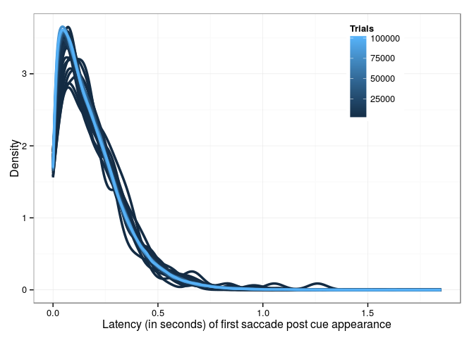
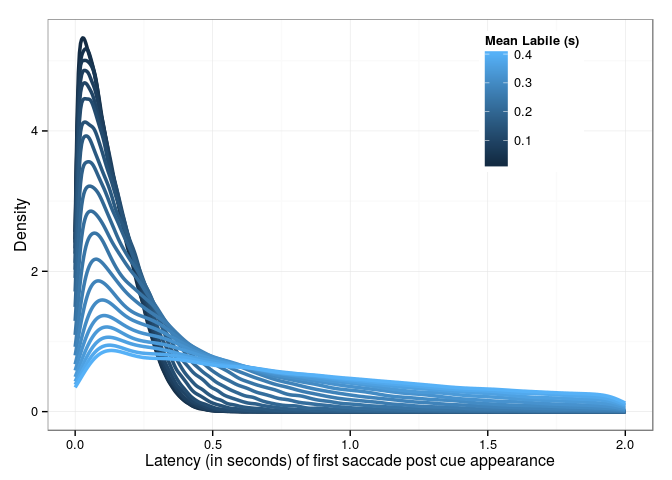
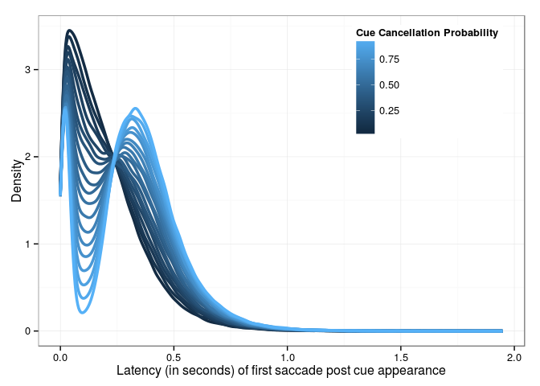

Mean Timer (N=11,labile=.180)
-----------------------------

Mean Labile (N=11,timer=.250)
-----------------------------

Gap Cancellation (N=11,timer=.250,labile=.180)
----------------------------------------------

Cue Cancellation (N=11,timer=.250,labile=.180)
----------------------------------------------

