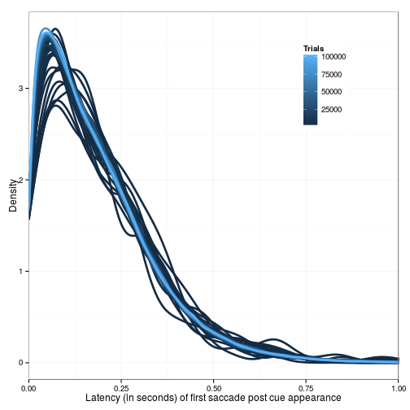
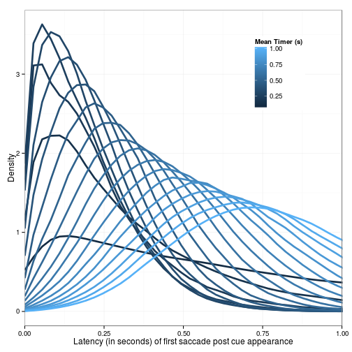
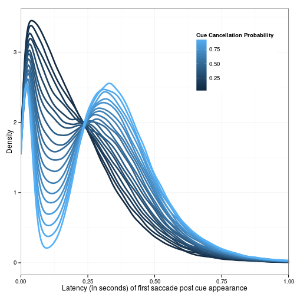

## Max Trials (N=11,timer=.250,labile=.180)
 
 

--- &twocol

## Mean Timer (N=11,labile=.180)

*** =left

 

*** =right

- The timer value seems to interact with the labile stage duration
 - When timer interval << labile duration, kurtosis <0, labile duration dominates mode
 - When timer interval ~= labile duration, kurtosis >0
 - When timer interval >> labile duration, kurtosis <0, timer interval dominates mode

---

## Mean Labile (N=11,timer=.250)

 

---

## Gap Cancellation (N=11,timer=.250,labile=.180)
 
 

---
 
## Cue Cancellation (N=11,timer=.250,labile=.180)
 
 
